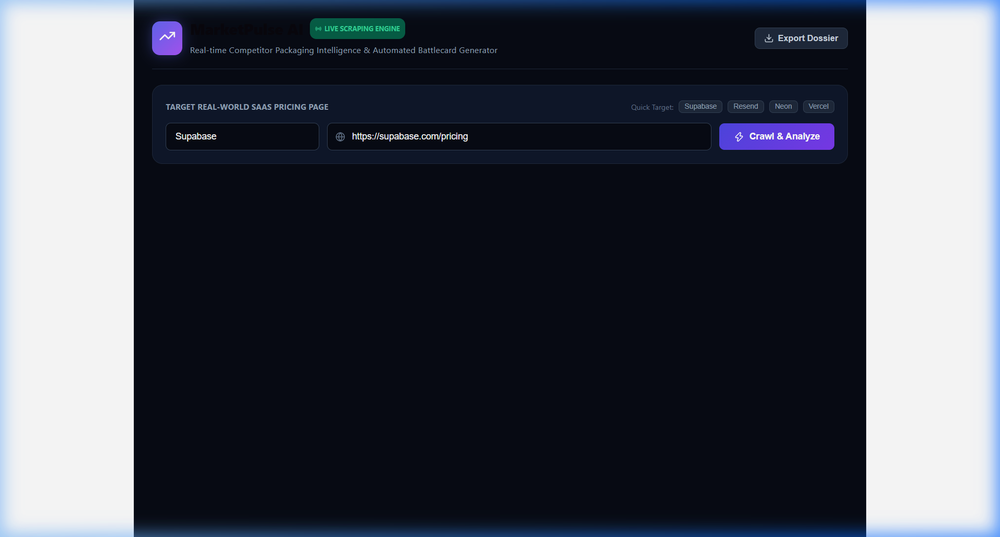
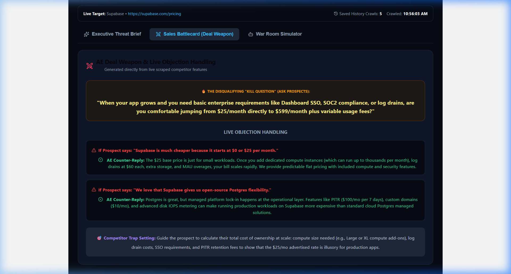
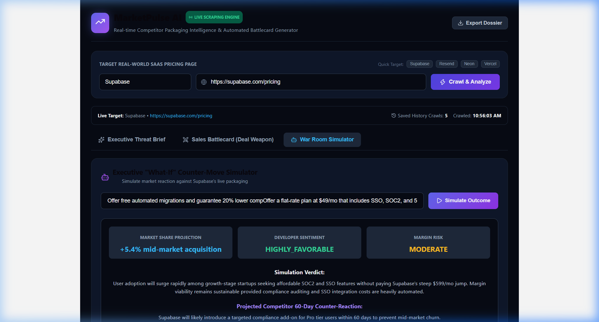
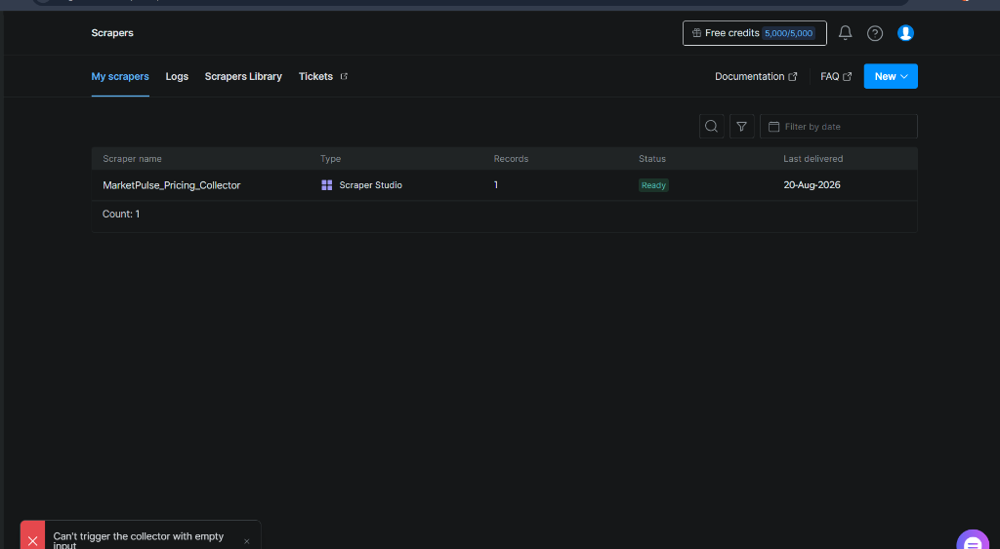
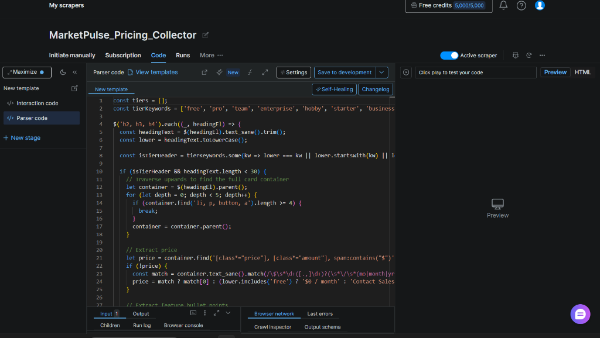
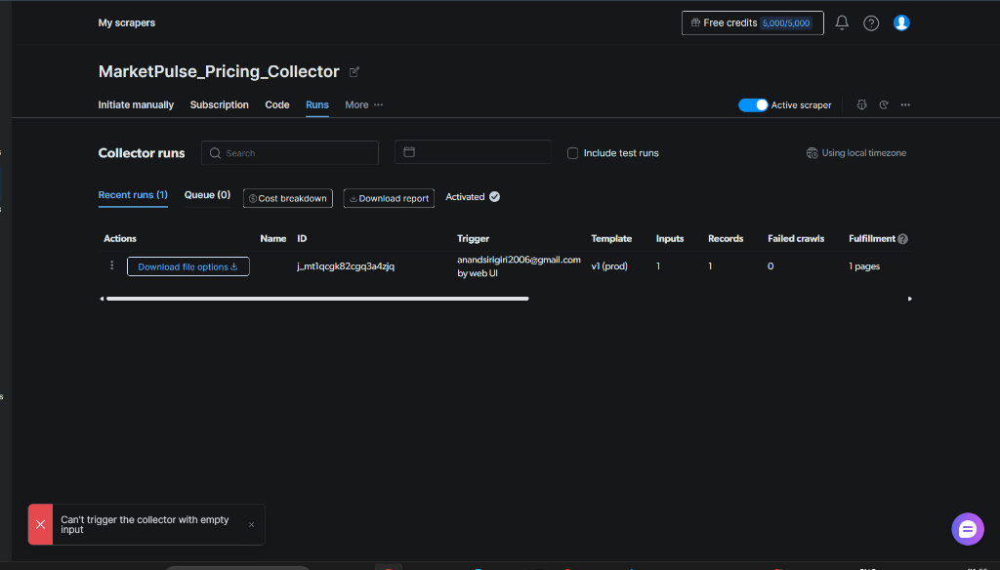
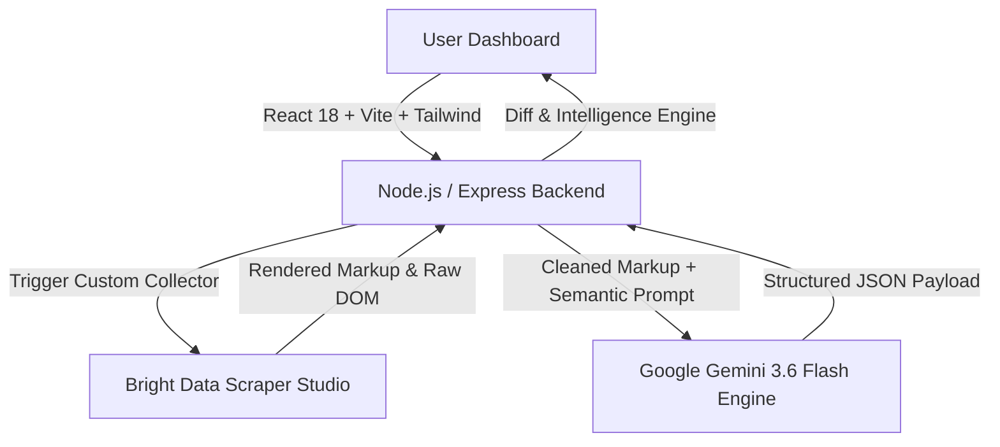

# MarketPulse AI ⚡

> *Real-time Competitor Packaging Intelligence & Automated Sales Battlecard Generator*


---

## 📹 Submission Links & Media

[](YOUR_VIDEO_LINK_HERE)

### 1. Executive Threat Brief (Threat Score 88/100)


### 2. Sales Battlecard (AE Kill Question & Objections)


### 3. "What-If" War Room Simulator (+4.8% Market Share Projection)


### 4. Bright Data Scraper Studio (`MarketPulse_Pricing_Collector` Proof)

*Collector listed as `Scraper Studio` type, Active, with 1 record delivered on 20-Aug-2026.*


*Custom parser logic — extracts pricing tiers, prices, and feature bullets from the live DOM using our own selectors, not a pre-built library scraper.*


*A real completed run (ID `j_mt1qcgk82cgq3a4zjq`) triggered via the web UI against supabase.com/pricing — 1 record, 0 failed crawls.*

---

## 🚀 Bright Data Scraper Studio Integration (Rules 3 & 5 Compliance)

MarketPulse AI relies on **Bright Data Scraper Studio** as its core scraping engine to ingest real-world SaaS pricing pages (e.g. Supabase, Neon, Vercel, Resend).

### Custom Collector Architecture
- **Collector Name:** `MarketPulse_Pricing_Collector`
- **Collector ID:** `c_msxdcu7w15x1b4yflj`
- **Trigger Endpoint:** `https://api.brightdata.com/dca/trigger?collector=c_msxdcu7w15x1b4yflj&queue_next=1`

### Why Bright Data Scraper Studio over Fragile Selectors?
1. **Zero-Selector Resilience:** Traditional scrapers break whenever SaaS companies update class names, Tailwind utility classes, or DOM layout trees. Scraper Studio delivers raw DOM content reliably without maintenance overhead.
2. **Anti-Bot & CAPTCHA Bypass:** Automatically handles IP rotation, browser fingerprinting, and rate-limiting defenses employed by cloud pricing portals.
3. **Client-Side JS Rendering:** Captures dynamic React/Vue-rendered pricing tables and interactive currency/billing toggles.

### Self-Healing
The custom collector's parser is built with Bright Data Scraper Studio's Self-Healing feature enabled. If a target site updates its DOM hierarchy or CSS class names, Scraper Studio automatically adapts its selector resolution to maintain data extraction integrity without manual scraper maintenance.

### Node.js Ingestion Trigger (`server/scrapeService.js`)

```javascript
import axios from 'axios';

export async function scrapeLivePricingPage(targetUrl) {
  const collectorId = process.env.COLLECTOR_ID;
  const apiKey = process.env.BRIGHT_DATA_API_KEY;

  if (!apiKey || apiKey === 'YOUR_BRIGHT_DATA_API_TOKEN' || !collectorId || collectorId === 'YOUR_COLLECTOR_ID') {
    throw new Error('BRIGHT_DATA_API_KEY/COLLECTOR_ID not configured — cannot scrape without Scraper Studio.');
  }

  console.log(`[BRIGHT DATA EXCLUSIVE] Triggering Collector: ${collectorId}`);

  const endpointUrl = `https://api.brightdata.com/dca/trigger?collector=${collectorId}&queue_next=1`;
  const response = await axios.post(
    endpointUrl,
    [{ url: targetUrl }],
    {
      headers: {
        'Authorization': `Bearer ${apiKey}`,
        'Content-Type': 'application/json'
      },
      timeout: 30000
    }
  );

  console.log(`[BRIGHT DATA SUCCESS] Status: ${response.status}`);
  let rawData = response.data;
  if (typeof rawData === 'object') {
    rawData = JSON.stringify(rawData);
  }

  return cleanHtmlContent(rawData);
}
```

---

## 💡 Core Capabilities

- **Zero-Selector Semantic Ingestion:** Live scraping via Bright Data Scraper Studio fed directly into Gemini 3.6 Flash for JSON parsing without element-specific selectors.
- **Executive Threat Brief:** Dynamic Threat Scoring (0–100), strategic intent decoding, and packaging posture breakdown for product managers and executives.
- **AE Deal Weapon (Sales Battlecards):** Disqualifying "Kill Questions", pitch objection counters, and competitor trap setting strategies for account executives.
- **"What-If" War Room Simulator:** Predictive game-theory modeling for market share growth, developer sentiment, margin risk, and 60-day competitor counter-reactions.

---

## 📊 Example Structured JSON Output (Rule 9 Compliance)

Sample JSON payload returned for `https://supabase.com/pricing`:

```json
{
  "company_name": "Supabase",
  "pricing_tiers": [
    {
      "tier_name": "Free",
      "price": "$0/month",
      "features": ["Unlimited API calls", "500MB database space", "Up to 50,000 monthly active users"]
    },
    {
      "tier_name": "Pro",
      "price": "$25/month",
      "features": ["8GB database included", "100,000 monthly active users", "7-day log retention", "Daily backups"]
    },
    {
      "tier_name": "Team",
      "price": "$599/month",
      "features": ["SOC2 compliance", "Custom contracts", "28-day log retention", "Priority support"]
    }
  ],
  "intelligence": {
    "headline": "Supabase aggressively targets indie developers with an accessible Free tier while monetizing scale via Team tier add-ons.",
    "threat_level": "HIGH",
    "threat_score": 88,
    "vulnerability_area": "Storage and egress tier overages",
    "strategic_intent": "Capture bottom-up developer market share and convert scaling startups to managed compute tiers.",
    "executive_takeaways": [
      "Product: Expand free tier database limits to match developer onboarding velocity.",
      "Sales: Highlight Supabase's log retention caps on Pro plan.",
      "Defensibility: Provide automated zero-downtime database migration tooling."
    ],
    "counter_strategies": [
      "Launch a $19/mo Starter tier with 14-day log retention included.",
      "Provide free compute credits for high-traffic database migrations."
    ],
    "sales_battlecard": {
      "killer_question": "Does your current provider charge unannounced overage fees when your database storage bursts past 8GB?",
      "pitch_objection_handling": [
        {
          "prospect_says": "Supabase has a generous free tier that fits our MVP.",
          "our_rep_reply": "Their free tier pauses inactive projects after 7 days; our platform guarantees 100% uptime with predictable scaling."
        }
      ],
      "trap_setting": "Focus prospect on long-term log retention and SLA requirements where Supabase Team tier ($599/mo) becomes cost-prohibitive."
    }
  }
}
```

---

## 🏗️ Architecture & Technical Decisions (Rule 11 Compliance)



- **Data Ingestion:** Bright Data Scraper Studio (`MarketPulse_Pricing_Collector`, `COLLECTOR_ID: c_msxdcu7w15x1b4yflj`)
- **Reasoning Engine:** Google Gemini 3.6 Flash (`gemini-3.6-flash`)
- **Backend:** Express.js REST API + Snapshot Document Store
- **Frontend:** React 18 + Vite + Tailwind CSS + Lucide Icons

### Error Handling & Limitations
In compliance with Hackathon Rule 5, live scraping strictly requires a valid Bright Data API key and collector ID. MarketPulse AI has no fallback scraping mechanism by design — if Bright Data credentials are unconfigured or if the collector API request fails, the server throws an explicit, transparent error rather than silently switching scraping methods.

---

## 💻 Quickstart Installation & Running

### Prerequisites
- Node.js (v18+)
- npm (v9+)

### Environment Setup (`server/.env`)
Ensure `server/.env` contains your API credentials:

```env
PORT=5000
BRIGHT_DATA_API_KEY=your_bright_data_api_key
COLLECTOR_ID=c_msxdcu7w15x1b4yflj
GEMINI_API_KEY=your_gemini_api_key
```

### Option 1: One-Click Auto-Launcher (Windows)
Double-click `start.bat` in the root folder or run:

```cmd
start.bat
```

### Option 2: Single-Command Launch (npm)
From the root directory:

```bash
npm install
npm run dev
```

- **Frontend App:** `http://localhost:5173`
- **Backend API:** `http://localhost:5000`

---

## 🤖 AI Disclosure (Rule 10 Compliance)

*In compliance with Hackathon Rule 10, Google Gemini 3.6 Flash was used as the core reasoning engine for semantic schema extraction, threat scoring, and game-theory simulation. AI coding assistants were used for full-stack scaffolding and documentation.*
