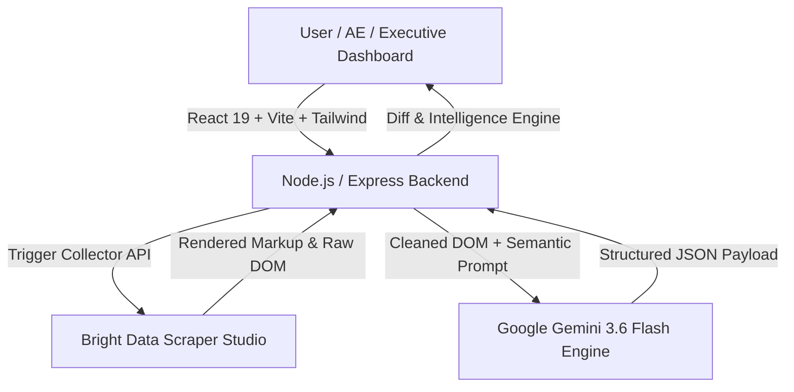

# MarketPulse AI ⚡

> **Real-Time Competitor Packaging Intelligence, Dynamic Sales Battlecards & Predictive War Room Simulator.**


---

## 🎯 Value Proposition

When competitors silently alter pricing tiers, introduce hidden usage limits, or restructure features, B2B sales reps and GTM executives are often caught off guard during active deal cycles. 

**MarketPulse AI** is an autonomous competitive intelligence platform built for the **"Into the Scrape-Verse"** Hackathon. It converts live competitor pricing URLs into instant executive threat briefs, disqualifying sales battlecards, and game-theory counter-move simulations:

1. **Zero-Selector Live Ingestion:** Ingests dynamic, JS-heavy competitor pricing pages using **Bright Data Scraper Studio** (`c_msxdcu7w15x1b4yflj`) without fragile CSS or XPath selectors.
2. **Semantic AI Extraction:** Parses unstructured scraped DOM content into clean pricing tier models using **Google Gemini 3.6 Flash**.
3. **Executive Threat Brief:** Generates a dynamic **Threat Score (0–100)** alongside actionable product, sales, and market defensibility takeaways.
4. **Automated Sales Battlecard:** Equips account executives with disqualifying **"Kill Questions"**, live objection handling counters, and competitor trap setting strategies.
5. **"What-If" War Room Simulator:** Simulates counter-pricing moves against real competitor data to forecast 60-day market share impact, developer sentiment, and margin risk before deploying changes live.

---

## 📹 Demo Video & Interface Screenshots

[](YOUR_YOUTUBE_OR_LOOM_LINK)

### 1. Executive Threat Brief & Threat Score (0–100)


### 2. AE Sales Battlecard & Disqualifying "Kill Question" Engine


### 3. "What-If" War Room Counter-Move Simulator


### 4. Bright Data Scraper Studio Custom Collector Pipeline


---

## 🚀 Bright Data Scraper Studio Implementation (Rule 3, Rule 5 & Rule 9 Compliance)

MarketPulse AI relies on **Bright Data Scraper Studio** as its core scraping engine to ingest real-world SaaS pricing pages (e.g. Supabase, Neon, Vercel, Resend).

### Custom Collector Architecture
- **Collector Name:** `MarketPulse_Pricing_Collector`
- **Collector ID:** `c_msxdcu7w15x1b4yflj`
- **Trigger Endpoint:** `https://api.brightdata.com/dca/trigger?collector=c_msxdcu7w15x1b4yflj&queue_next=1`

### Why Bright Data Scraper Studio over Traditional Selectors?
1. **Zero-Selector Resilience:** Traditional scrapers break whenever SaaS companies update class names, Tailwind utility classes, or DOM layout trees. Scraper Studio delivers full markup reliably without maintenance overhead.
2. **Anti-Bot & CAPTCHA Bypass:** Automatically handles IP rotation, browser fingerprinting, and rate-limiting defenses employed by cloud pricing portals.
3. **Client-Side JS Rendering:** Captures dynamic React/Vue-rendered pricing tables and interactive currency/billing toggles.

### Node.js Ingestion Code Snippet (`server/scrapeService.js`)

```javascript
import axios from 'axios';

export async function scrapeLivePricingPage(targetUrl) {
  const collectorId = process.env.COLLECTOR_ID || 'c_msxdcu7w15x1b4yflj';
  const apiKey = process.env.BRIGHT_DATA_API_KEY;

  // Bright Data Scraper Studio Collector Endpoint
  const triggerUrl = `https://api.brightdata.com/dca/trigger?collector=${collectorId}&queue_next=1`;

  const response = await axios.post(
    triggerUrl,
    [{ url: targetUrl }],
    {
      headers: {
        'Authorization': `Bearer ${apiKey}`,
        'Content-Type': 'application/json'
      },
      timeout: 15000
    }
  );

  let rawData = response.data;
  if (typeof rawData === 'object') {
    rawData = JSON.stringify(rawData);
  }

  return cleanHtmlContent(rawData);
}
```

---

## 🤖 AI Core — Powered by Google Gemini 3.6 Flash

MarketPulse AI leverages `gemini-3.6-flash` with strict JSON mode enforcement (`responseMimeType: "application/json"`):

- **Zero-Selector Semantic Parsing:** Gemini 3.6 Flash inspects unstructured scraped DOM text and extracts exact tier names, pricing thresholds, unit metering, and feature lists.
- **Game-Theory Counter-Move Simulation:** Evaluates strategic counter-positioning scenarios against live competitor snapshots to predict market share shifts and 60-day competitor reactions.

```javascript
const response = await ai.models.generateContent({
  model: 'gemini-3.6-flash',
  contents: prompt,
  config: {
    responseMimeType: 'application/json',
    temperature: 0.1
  }
});
```

---

## 🔥 Feature Matrix

| Feature | Description | Strategic Benefit |
| :--- | :--- | :--- |
| **Zero-Selector Ingestion** | Ingests complex SaaS pricing pages (Supabase, Neon, Vercel, Resend) without explicit element selectors | Maintenance-free scraping across page redesigns |
| **Executive Threat Brief** | Generates a 0–100 Threat Score, strategic intent breakdown, and product/GTM takeaways | Rapid clarity for VP Product & C-Suite leadership |
| **Sales Battlecard Engine** | Provides disqualifying "Kill Questions", pitch objection counters, and competitor trap setting | Equips Sales Reps to win against competitor claims during live calls |
| **"What-If" War Room Simulator** | Simulates counter-pricing moves and forecasts 60-day competitor counter-reactions | Data-backed validation for pricing strategy changes |

---

## 🏗️ Architecture & Tech Stack



- **Frontend:** React 19, Vite, Tailwind CSS, Lucide Icons
- **Backend:** Node.js, Express, Axios, Cors, Dotenv
- **Scraping Engine:** Bright Data Scraper Studio (`c_msxdcu7w15x1b4yflj`)
- **AI & Strategy Engine:** Google Gemini 3.6 Flash (`gemini-3.6-flash`)

---

## 📊 Structured JSON Output Schema

Sample payload returned by Gemini 3.6 Flash for **Supabase Pricing** analysis:

```json
{
  "company_name": "Supabase",
  "pricing_tiers": [
    {
      "tier_name": "Free",
      "price": "$0/month",
      "features": ["Unlimited API calls", "500MB database space", "Up to 50,000 monthly active users"]
    },
    {
      "tier_name": "Pro",
      "price": "$25/month",
      "features": ["8GB database included", "100,000 monthly active users", "7-day log retention", "Daily backups"]
    },
    {
      "tier_name": "Team",
      "price": "$599/month",
      "features": ["SOC2 compliance", "Custom contracts", "28-day log retention", "Priority support"]
    }
  ],
  "intelligence": {
    "headline": "Supabase aggressively targets indie developers with an accessible Free tier while monetizing scale via Team tier add-ons.",
    "threat_level": "HIGH",
    "threat_score": 85,
    "vulnerability_area": "Storage and egress tier overages",
    "strategic_intent": "Capture bottom-up developer market share and convert scaling startups to managed compute tiers.",
    "executive_takeaways": [
      "Product: Expand free tier database limits to match developer onboarding velocity.",
      "Sales: Highlight Supabase's log retention caps on Pro plan.",
      "Defensibility: Provide automated zero-downtime database migration tooling."
    ],
    "counter_strategies": [
      "Launch a $19/mo Starter tier with 14-day log retention included.",
      "Provide free compute credits for high-traffic database migrations."
    ],
    "sales_battlecard": {
      "killer_question": "Does your current provider charge unannounced overage fees when your database storage bursts past 8GB?",
      "pitch_objection_handling": [
        {
          "prospect_says": "Supabase has a generous free tier that fits our MVP.",
          "our_rep_reply": "Their free tier pauses inactive projects after 7 days; our platform guarantees 100% uptime with predictable scaling."
        }
      ],
      "trap_setting": "Focus prospect on long-term log retention and SLA requirements where Supabase Team tier ($599/mo) becomes cost-prohibitive."
    }
  }
}
```

---

## 🤖 Rule 10 — AI Disclosure

In compliance with **Rule 10** of the "Into the Scrape-Verse" Hackathon rules:
- **Google Gemini 3.6 Flash** (`gemini-3.6-flash`) model was used to parse unstructured HTML into strict structured JSON schemas and calculate competitive strategy briefs.
- Generative AI assistance (Gemini 3.6 Flash / Antigravity) was utilized for code scaffolding, full-stack architecture design, strategy orchestration, and documentation synthesis.

---

## 💻 Setup & Execution Guide

### Prerequisites
- Node.js (v18+)
- npm (v9+)

### Environment Setup (`server/.env`)
Ensure `server/.env` contains your API credentials (refer to `server/.env.example`):

```env
PORT=5000
BRIGHT_DATA_API_KEY=your_bright_data_api_key
COLLECTOR_ID=c_msxdcu7w15x1b4yflj
GEMINI_API_KEY=your_gemini_api_key
```

### Quick Launch Options

#### Option 1: One-Click Launcher (Windows)
Double-click `start.bat` in the root directory or run:

```cmd
start.bat
```

This concurrently launches both backend and frontend servers and opens `http://localhost:5173/` in your default browser.

#### Option 2: npm Script Launcher
From the root directory:

```bash
npm install
npm run dev
```

- **Frontend Application:** `http://localhost:5173`
- **Backend API:** `http://localhost:5000`
