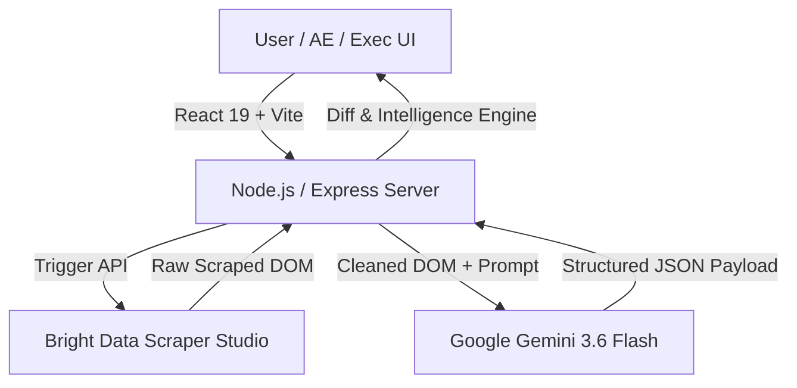

# MarketPulse AI — Real-time Competitor Packaging Intelligence & Automated Sales Battlecards

> **"Into the Scrape-Verse" Hackathon Submission**
> Autonomous zero-selector web scraping meets generative strategic analysis to turn competitor pricing changes into instant sales battlecards and executive threat briefings.

---

## 🎯 Value Proposition

When competitors silently alter pricing tiers, add limits, or rename plans, B2B sales reps and GTM executives are often caught off guard. **MarketPulse AI** automates real-time competitive intelligence:

1. **Zero-Selector Live Scrape:** Ingests competitor pricing URLs dynamically without brittle CSS selectors via **Bright Data Scraper Studio**.
2. **Structured AI Parsing:** Extracts messy DOM payloads into structured pricing models using **Google Gemini 3.6 Flash**.
3. **Automated Executive Threat Brief:** Calculates a dynamic **Threat Score (0-100)** and strategic breakdown of competitor moves.
4. **Instant Sales Battlecard:** Generates targeted "Kill Questions", pitch objection handling, and sales trap strategies for account executives.
5. **"What-If" War Room Simulator:** Simulates counter-pricing moves against real competitor data before deploying changes live.

---

## 🚀 Bright Data Scraper Studio Integration

MarketPulse AI relies on **Bright Data Scraper Studio** to bypass anti-scraping defenses, rendered JavaScript barriers, and localized pricing paywalls.

### Custom Collector
- **Collector ID:** `c_msxdcu7w15x1b4yflj`
- **Trigger Endpoint:** `https://api.brightdata.com/dca/trigger?collector=c_msxdcu7w15x1b4yflj&queue_next=1`

### Pipeline Architecture Code Snippet (`server/scrapeService.js`)

```javascript
import axios from 'axios';
import { GoogleGenAI } from '@google/genai';

const ai = new GoogleGenAI({ apiKey: process.env.GEMINI_API_KEY });

export async function scrapeLivePricingPage(targetUrl) {
  const collectorId = process.env.COLLECTOR_ID || 'c_msxdcu7w15x1b4yflj';
  const apiKey = process.env.BRIGHT_DATA_API_KEY;

  // Trigger Bright Data Scraper Studio API
  const endpointUrl = `https://api.brightdata.com/dca/trigger?collector=${collectorId}&queue_next=1`;
  const response = await axios.post(
    endpointUrl,
    [{ url: targetUrl }],
    {
      headers: {
        'Authorization': `Bearer ${apiKey}`,
        'Content-Type': 'application/json'
      }
    }
  );

  return cleanHtmlContent(response.data);
}
```

---

## 🔥 Feature Matrix

| Feature | Description | Strategic Benefit |
| :--- | :--- | :--- |
| **Zero-Selector Ingestion** | Ingests complex SaaS pricing pages (Supabase, Neon, Vercel, Resend) without explicit element selectors | Maintenance-free scraping across page redesigns |
| **Executive Threat Brief** | Generates 0-100 Threat Score, strategic intent analysis, and product/GTM takeaways | Instant clarity for VP Product & C-Suite |
| **Sales Battlecard Engine** | Provides disqualifying "Kill Questions" and objection handling responses | Arms Sales Reps during active deal cycles |
| **"What-If" War Room Simulator** | Simulates counter-positioning scenarios and forecasts 60-day competitor reactions | Data-backed pricing strategy validation |

---

## 🏗️ Architecture & Tech Stack



- **Frontend:** React 19, Vite, Tailwind CSS, Lucide Icons
- **Backend:** Node.js, Express, Axios, Cors, Dotenv
- **Scraping Engine:** Bright Data Scraper Studio (`c_msxdcu7w15x1b4yflj`)
- **AI & Strategy Engine:** Google Gemini 3.6 Flash (`gemini-3.6-flash`) for zero-selector semantic extraction and game-theory simulation reasoning

---

## 📊 Structured JSON Output Schema

Sample payload returned by Gemini 3.6 Flash for **Supabase Pricing** analysis:

```json
{
  "company_name": "Supabase",
  "pricing_tiers": [
    {
      "tier_name": "Free",
      "price": "$0/month",
      "features": ["Unlimited API calls", "500MB database space", "Up to 50,000 monthly active users"]
    },
    {
      "tier_name": "Pro",
      "price": "$25/month",
      "features": ["8GB database included", "100,000 monthly active users", "7-day log retention", "Daily backups"]
    },
    {
      "tier_name": "Team",
      "price": "$599/month",
      "features": ["SOC2 compliance", "Custom contracts", "28-day log retention", "Priority support"]
    }
  ],
  "intelligence": {
    "headline": "Supabase aggressively targets indie developers with an accessible Free tier while monetizing scale via Team tier add-ons.",
    "threat_level": "HIGH",
    "threat_score": 85,
    "vulnerability_area": "Storage and egress tier overages",
    "strategic_intent": "Capture bottom-up developer market share and convert scaling startups to managed compute tiers.",
    "executive_takeaways": [
      "Product: Expand free tier database limits to match developer onboarding velocity.",
      "Sales: Highlight Supabase's log retention caps on Pro plan.",
      "Defensibility: Provide automated zero-downtime database migration tooling."
    ],
    "counter_strategies": [
      "Launch a $19/mo Starter tier with 14-day log retention included.",
      "Provide free compute credits for high-traffic database migrations."
    ],
    "sales_battlecard": {
      "killer_question": "Does your current provider charge unannounced overage fees when your database storage bursts past 8GB?",
      "pitch_objection_handling": [
        {
          "prospect_says": "Supabase has a generous free tier that fits our MVP.",
          "our_rep_reply": "Their free tier pauses inactive projects after 7 days; our platform guarantees 100% uptime with predictable scaling."
        }
      ],
      "trap_setting": "Focus prospect on long-term log retention and SLA requirements where Supabase Team tier ($599/mo) becomes cost-prohibitive."
    }
  }
}
```

---

## 🤖 Rule 10 — AI Disclosure

In compliance with **Rule 10** of the "Into the Scrape-Verse" Hackathon rules:
- **Google Gemini 3.6 Flash** (`gemini-3.6-flash`) model was used to parse unstructured HTML into strict structured JSON schemas and calculate competitive strategy briefs.
- Generative AI assistance (Gemini 3.6 Flash / Antigravity) was utilized for code scaffolding, full-stack architecture design, strategy orchestration, and documentation synthesis.

---

## 💻 Setup & Execution Guide

### Prerequisites
- Node.js (v18+)
- npm (v9+)

### Environment Setup (`server/.env`)
Ensure `server/.env` contains your API credentials:

```env
PORT=5000
BRIGHT_DATA_API_KEY=your_bright_data_api_key
COLLECTOR_ID=c_msxdcu7w15x1b4yflj
GEMINI_API_KEY=your_gemini_api_key
```

### Option 1: One-Command Launcher (Windows)
Double-click `start.bat` in the root folder or run:

```cmd
start.bat
```

This concurrently launches both the backend and frontend servers and opens `http://localhost:5173/` in your default browser.

### Option 2: npm Script Launcher
From the root directory:

```bash
npm install
npm run dev
```

### Option 3: Manual Execution
```bash
# Terminal 1: Backend
cd server
npm start

# Terminal 2: Frontend
cd client
npm run dev
```

- **Frontend App:** `http://localhost:5173`
- **Backend API:** `http://localhost:5000`
